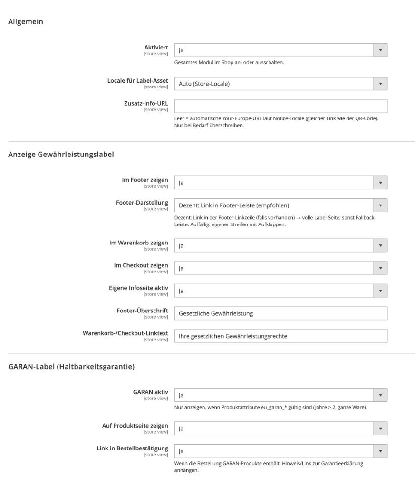

# Magento 2 EU Guarantee Label & GARAN

Magento Open Source / Adobe Commerce module for the **EU harmonised legal guarantee notice** and optional **GARAN** commercial durability guarantee.

Built for shops that need a clear, compliant way to show consumer guarantee information in the storefront – without locking you into one theme.

Compatible with **Luma** and **Hyvä Theme**.

## Features

- Harmonised EU legal guarantee label (multi-language SVGs)
- Optional GARAN label on the product page (years / brand / model)
- Footer notice or discreet footer link
- Cart & checkout short link
- Dedicated info page (`/eu-guarantee/notice`)
- REST API + XML import for GARAN product data
- Order email variable for GARAN notes
- Admin configuration under **Solutioo → EU Gewährleistung / GARAN** (also via Stores → Configuration)

Depends on [`solutioo/module-base`](https://github.com/solutioo365/magento-base).

## Requirements

- Magento 2.4.x / Adobe Commerce 2.4.x
- PHP 8.1+
- `solutioo/module-base` ^1.0

## Installation

### Composer

```bash
composer config repositories.solutioo composer https://www.solutioo.de/packages/
composer require solutioo/module-eu-guarantee-label
bin/magento module:enable Solutioo_Base Solutioo_EuGuaranteeLabel
bin/magento setup:upgrade
bin/magento setup:di:compile
bin/magento setup:static-content:deploy de_DE en_US -f --area frontend
bin/magento cache:flush
```

### Manual

1. Install [Solutioo Base](https://github.com/solutioo365/magento-base) into `app/code/Solutioo/Base`
2. Copy this module to `app/code/Solutioo/EuGuaranteeLabel`
3. Run the Magento commands above

## Configuration

**Solutioo → EU Gewährleistung / GARAN**  
(or: Stores → Configuration → Solutioo → EU Gewährleistung / GARAN)

Turn the module on, choose footer style (link or banner), locale handling, cart/checkout text and GARAN options.



*Magento Admin – module settings (General, storefront display, GARAN)*

More detail: [`docs/KONFIGURATION.md`](docs/KONFIGURATION.md)  
API reference: [`docs/API.md`](docs/API.md)

## Storefront placement

| Location | Behaviour |
|----------|-----------|
| Footer | Link in the footer link row, or expandable banner |
| `/eu-guarantee/notice` | Full-size legal guarantee label |
| Cart / Checkout | Short legal notice under the checkout buttons |
| Product page | GARAN when product attributes are set |
| Order email | `{{var solutioo_eu_garan_note\|raw}}` (add to your template) |

## GARAN product attributes

| Attribute | Purpose |
|-----------|---------|
| `eu_garan_enabled` | Show GARAN for this product |
| `eu_garan_years` | Duration in years (must be greater than 2) |
| `eu_garan_brand` | Brand line on the label |
| `eu_garan_model` | Model line on the label |
| `eu_garan_declaration` | Optional declaration URL |

## Theme notes

- **Luma:** footer uses Magento’s footer container; cart notice hooks into `checkout.cart.methods.bottom`
- **Hyvä:** footer is attached via `default_hyva.xml`; cart uses the same methods block Hyvä already provides

No theme package is required. You can still restyle via CSS (`Solutioo_EuGuaranteeLabel::css/eu-guarantee.css`).

## Legal note

Label artwork follows European Commission guidance for the harmonised notice and GARAN.  
Correct legal use in your shop remains the merchant’s responsibility. Have your counsel review before go-live.

## Support

- [www.solutioo.de](https://www.solutioo.de)
- info@solutioo.de
- GitHub issues on this repository

## Licence

OSL-3.0 / AFL-3.0

---

Keywords: Magento 2 EU guarantee label, Magento GARAN module, harmonised legal guarantee notice, EU consumer rights Magento, Hyvä Theme guarantee label, Magento 2 Gewährleistung, Adobe Commerce EU label, commercial durability guarantee Magento
